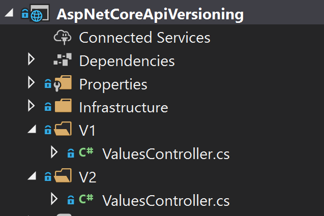
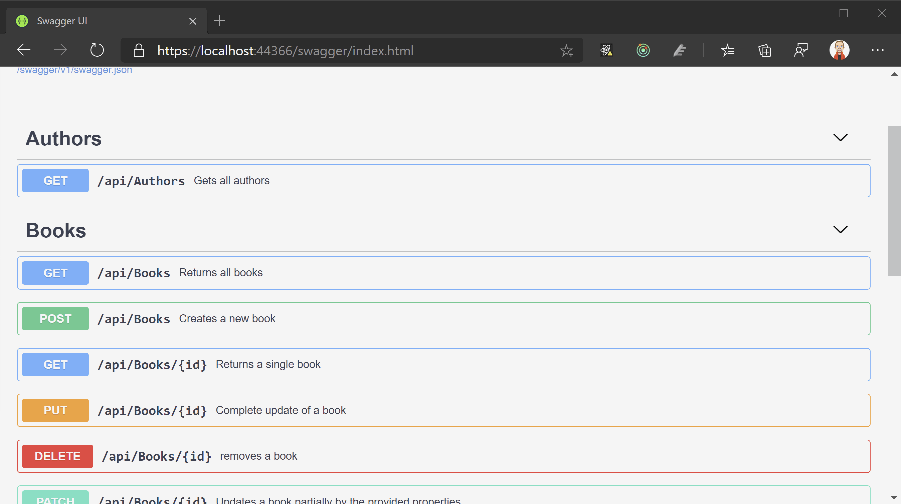
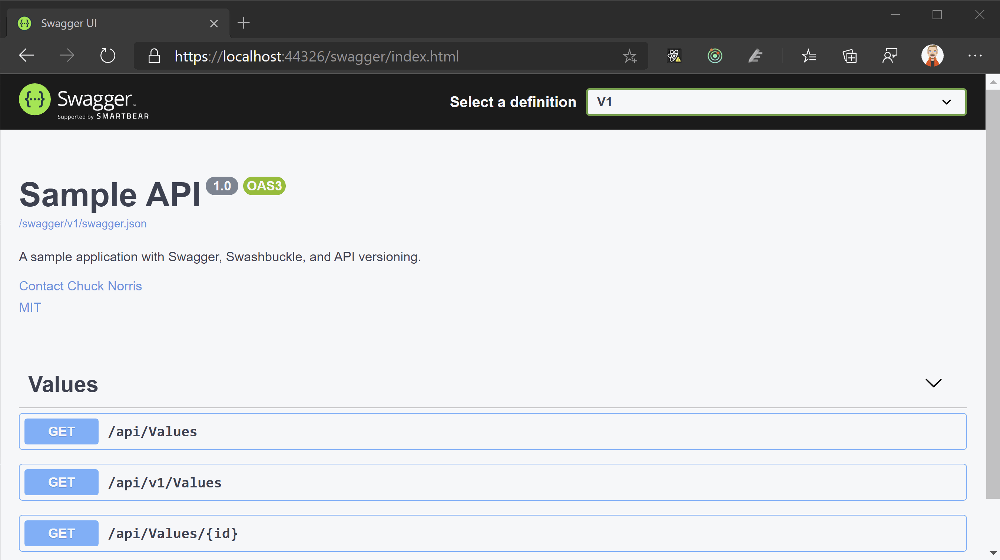

# API Versionierung und Dokumentation

In den REST-Guidelines und Beispielen von API Anbietern wie Microsoft oder Github kann man gut erkennen, dass die Versionierung einer Schnittstelle vorab geklärt werden sollte, noch bevor der erste Kunde (egal ob extern oder intern) darauf zugreift. Änderungen oder **Breaking Changes** in einer bestehenden API können verheerende Auswirkungen haben. Zusätzlich sollte eine umfassende Dokumentation vorhanden sein, welche die Möglichkeiten und Verwendung der API beschreibt. Diese mit der tatsächlichen Implementierung synchron zu halten ist seit jeher eine Herausforderung für uns Entwickler 😉.

Glücklicherweise gibt es für REST-APIs mit .NET einige hilfreiche Libraries, welche uns die meiste Arbeit abnehmen.

## API Versionierung

Wir haben bereits behandelt, wie mit `Attribute Routing` die Route und das HTTP Verb für einen Endpunkt definiert werden kann.

```csharp
[ApiController]
[Route("api/[controller]")]
public class ValuesController : ControllerBase
{
    [HttpGet]
    public ActionResult<IEnumerable<string>> Get()
    {
        // Implementierung
    }

    [HttpGet("{id}")]
    public ActionResult<string> Get(int id, ApiVersion apiVersion)
    {
        // Implementierung
    }
}
```

Das `[Route]`-Attribut über der Klasse legt das URL-Präfix unseres Controllers fest und ein Aufruf könnte so aussehen: `GET /api/values`.

Eine einfache Variante der Versionierung wäre es, die Version in das Präfix zu integrieren.

```csharp
[ApiController]
[Route("api/v1/[controller]")]
public class ValuesController : ControllerBase
{
}
```

Nun kann mit `GET /api/v1/values` zugegriffen werden. Dieser Ansatz funktioniert, hat aber einige Nachteile.
Zum einen ist `v1` ein beliebiges Literal das für das Routing System in aspnetcore keinerlei Bedeutung hat. Zum anderen haben wir in den Guidelines gesehen, dass die Version auch über andere Wege wie z.B. `queryparameter` oder `header` geliefert werden kann. Unser einfacher Ansatz funktioniert nur wenn über die URL zugegriffen wird.
Zusätzlich können Dokumentationstools wie `Swagger` aus dem Literal nicht automatisch eine Version erkennen und dies somit auch nicht festhalten.

Das [api-versioning](https://github.com/microsoft/aspnet-api-versioning/wiki) kann uns die Versionierung erheblich erleichtern.

### Nuget für API Versionierung installieren

Zuerst müssen wir das Nuget `Microsoft.AspNetCore.Mvc.Versioning` installieren, um die Versionsmöglichkeiten nachzurüsten. Entweder über den Package-Manager der IDE oder über `dotnet package add`.

### Versionierung in der Startup registrieren

Die Versionierung ist am Ende wie so oft nichts anderes als eine Middleware-Komponente welche in unserem Startup-Code registriert werden muss.

```csharp
public void ConfigureServices(IServiceCollection services)
{
    services.AddApiVersioning(
        options =>
        {
            // reporting api versions will return the headers "api-supported-versions" and "api-deprecated-versions"
            options.ReportApiVersions = true;
            options.AssumeDefaultVersionWhenUnspecified = true;
        });
}
```

Mit `ReportApiVersions` wird uns automatisch in der Response ein `api-supported-versions` Header mitgeliefert, welcher die unterstützten Versionen an den Aufrufer zurückgibt, so können auch automatisiert die veralteten Versionsnummern zurückgegeben werden. Wird keine spezifische Version angefordert, kann statt einen Fehler zu werfen auch eine Default-Version angewendet werden, z.B. immer die Aktuellste.

### Versionsattribute anwenden

Die Versionierung erfolgt mittels des `[ApiVersion]`-Attributes. Da ein Controller / Action mehr als ein `[Route]`-Attribute verwenden dürfen, können wir eine Default-Route und eine versionierte anbieten.

```csharp
[ApiController]
// 👇 Definition der API-Version
[ApiVersion("1.0")]

[Route("api/[controller]")]
//             👇 Platzhalter-Variable für API-Version
[Route("api/v{version:apiVersion}/[controller]")]
public class ValuesController : ControllerBase
{
}
```

Falls nötig kann auch innerhalb einer Controller-Action auf die verwendete Version zugegriffen werden.

```csharp
[HttpGet]
public ActionResult<IEnumerable<string>> Get()
{
    // API Version kann über eine Extension Method am Context abgerufen werden.
    var apiVersion = HttpContext.GetRequestedApiVersion();

    return new [] {apiVersion.ToString()};
}

[HttpGet("{id}")]
public ActionResult<string> Get(int id, ApiVersion apiVersion)
{
    // API Version kann über den Modelbinder direkt injected werden.
    return apiVersion.ToString();
}
```

### Neuer Controller für V2

Eine Möglichkeit eine neue Version unseres Controllers anzulegen, ist folgende Projektstruktur.



Nun können wir mit Hilfe der Attribute die gewünschte Versionierung definieren.

Version 1

```csharp
[ApiController]
[ApiVersion("1.0")]
[Route("api/[controller]")]
[Route("api/v{version:apiVersion}/[controller]")]
public class ValuesController : ControllerBase
{
    // ...
}
```

Version 2

```csharp
[ApiController]
[ApiVersion("2.0")]
[Route("api/v{version:apiVersion}/[controller]")]
public class ValuesController : ControllerBase
{
    // ...
}

```

### Hinweise zur Versionierung

Es lassen sich auch einzelne `ControllerActions` versionieren. Meiner Erfahrung nach ist es aber meist verständlicher, einen neuen `Controller` zu definieren. Die Möglichkeiten der Library sind umfangreich, ein Wiki beschreibt die Verwendung sehr gut: https://github.com/microsoft/aspnet-api-versioning/wiki .

## API Dokumentation mit Swagger

Jeder Entwickler kennt das Problem, dass die Dokumentation einer Softwarelösung meist mehr oder weniger stark von der tatsächlichen Implementierung abweicht. Um diesem Problem etwas entgegenzusetzen, hat die [OpenAPI Initiative](https://www.openapis.org/) (ehemals Swagger) einen Ansatz für die automatische Dokumentation einer REST-Schnittstelle inkl. maschinenlesbarem Format definiert. Der große Vorteil ist, dass die Beschreibung direkt aus dem Code bzw. zur Laufzeit der API generiert wird. Es gibt eine Vielzahl von Frameworks für praktisch alle Sprachen mit denen Web-APIs erstellt werden, welche den OpenAPI Ansatz umsetzen. Die bekannteste für .NET ist **Swashbuckle**. Swashbuckle besteht aus einzelnen Komponenten, unter anderem des Beschreibngsmoduls, einer Web-Oberfläche und einigen hilfreichen anderen Modulen.

### Swashbuckle installieren

Um Swashbuckle im Projekt zu verwenden müssen folgende Nuget Pakete installiert werden:

- `Swashbuckle.AspNetCore`
- `Swashbuckle.AspNetCore.Swagger`

### Swashbuckle registrieren

Auch Swashbuckle ist als Middleware umgesetzt, d.h. wir müssen es in unserer `Startup.cs` registrieren.

```csharp
public class Startup
{
    public void ConfigureServices(IServiceCollection services)
    {
        services.AddMvc();

        services.AddSwaggerGen(c =>
        {
            c.SwaggerDoc("v1", new OpenApiInfo { Title = "Jokes API", Version = "v1" });
        });
    }

    public void Configure(IApplicationBuilder app, IWebHostEnvironment env)
    {
        app.UseSwagger();
        app.UseSwaggerUI(c => { c.SwaggerEndpoint("/swagger/v1/swagger.json", "v1"); });

        app.UseRouting();

        app.UseEndpoints(endpoints =>
        {
            endpoints.MapControllers();
        });
    }
}
```

`AddSwaggerGen()` registriert die benötigten Services für OpenAPI. Optional können noch Informationen über die API, Ansprechpartner, usw. angegeben werden.

Die folgenden beiden Zeilen hängen Swagger in die Request-Pipeline ein.

```csharp
app.UseSwagger();
app.UseSwaggerUI(c => { c.SwaggerEndpoint("/swagger/v1/swagger.json", "v1"); });
```

Hier geben wir an, dass wir sowohl die Basisfunktionalität von Swagger als auch die Web-App nutzen wollen.
Mittels `SwaggerEndpoint` kann festgelegt werden, unter welcher URL die maschinenlesbare Version abgelegt wird.

### Swagger UI

Startet man nun das Projekt, steht die Web-App unter der Standard-URL /swagger zur Verfügung.


### XML Kommentare einbeziehen

In C# gibt es eine zusätzliche Art von Kommentaren die mit `///` eingeleitet werden. Damit lassen sich Beschreibungen für Klassen, Methoden und eben auch Endpunkte erstellen. Hier ein Beispiel.

```csharp
/// <summary>
/// Returns all books
/// </summary>
/// <returns>all books</returns>
[HttpGet]
public async Task<ActionResult<IEnumerable<Book>>> GetAll()
{
    // ...
}

/// <summary>
/// Returns a single book
/// </summary>
/// /// <remarks>
/// Sample request:
///
///     GET /books/1
///
/// </remarks>
/// <param name="id">id of the book</param>
/// <returns>a book</returns>
[HttpGet("{id}")]
public async Task<ActionResult<Book>> GetById(string id)
{
   // ...
}


/// <summary>
/// Creates a new book
/// </summary>
/// <param name="book">data for the book to create</param>
/// <returns>the newly created book</returns>
[HttpPost]
public async Task<ActionResult<Book>> CreateNew([FromBody] Book book)
{
    // ...
}

/// <summary>
/// Complete update of a book
/// </summary>
/// <param name="id">id of the book to update</param>
/// <param name="book">data of the book</param>
/// <returns></returns>
[HttpPut("{id}")]
public async Task<ActionResult<Book>> Update(string id, [FromBody] Book book)
{
    // ...
}

```

Swagger kann so konfiguriert werden, dass diese Kommentare ebenfalls in die Dokumentation einfließen.
Dazu müssen wir zuerst unser Projekt so konfigurieren, dass die XML-Kommentare in einem File abgelegt werden.
Dies kann über das `*.csproj` File angepasst werden. In einer beliebigen `<PropertyGroup>` muss `<GenerateDocumentationFile>true</GenerateDocumentationFile>` eingefügt werden. Das kann am Ende so aussehen:

```xml
<Project Sdk="Microsoft.NET.Sdk.Web">

  <PropertyGroup>
    <TargetFramework>netcoreapp3.1</TargetFramework>
  </PropertyGroup>
  <PropertyGroup>
    <GenerateDocumentationFile>true</GenerateDocumentationFile>
  </PropertyGroup>

</Project>

```

Nun müssen wir noch Swagger mitteilen, dass es diese XML-Kommentare berücksichtigen soll.
Hierzu passen wir unsere `ConfigureServices` an.

```csharp
public class Startup
{
    public void ConfigureServices(IServiceCollection services)
    {
        services.AddMvc();

        services.AddSwaggerGen(c =>
        {
            c.SwaggerDoc("v1", new OpenApiInfo { Title = "Jokes API", Version = "v1" });

            // C# XML-Kommentare für API-Beschreibung nutzen
            string xmlFile = $"{Assembly.GetExecutingAssembly().GetName().Name}.xml";
            string xmlPath = Path.Combine(AppContext.BaseDirectory, xmlFile);
            c.IncludeXmlComments(xmlPath);
        });
    }
}
```

Starten wir nun wieder die Anwendung, sehen wir die zusätzlichen Informationen direkt in der Schnittstellendokumentation.



## Versionierung und Dokumentation

Zuletzt wollen wir API-Versionierung und die Dokumentation mit OpenAPI (Swagger / Swashbuckle) kombinieren.
Dazu ist etwas mehr Implementierungsarbeit notwendig, allerdings gibt es hier ein Sample das die Verwendung (Copy & Paste) vereinfacht [Code](https://github.com/microsoft/aspnet-api-versioning/tree/master/samples/aspnetcore/SwaggerSample).

Eine lauffähige Implementierung findet Ihr hier: https://github.com/florianwachs/AspNetWebservicesCourse/tree/main/10_apiversioning/lessons.

Damit werden die unterschiedlichen Versionen automatisch erfasst.

