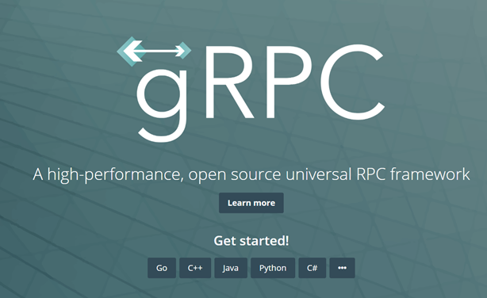
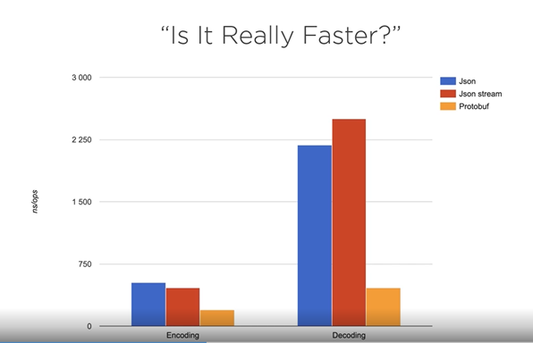

# gRPC

## Ansätze für verteilte APIs

- RPC
- Messaging, Queuing
- COM, DCOM, COBRA, JAVA RMI / .NET Remoting
- SOAP, REST
- GraphQL, ODATA
- gRPC

## gRPC

(Google) Remote Procedure Call



- Binäre Kommunikation
- Plattformübergreifend (Java, JavaScript (Node), Python, Go)
- Unterstützung für bidirektionales Streaming
- Nur über HTTPS/2 => TLS/SSL Zwang

## Wie passt gRPC in bestehende Ansätze?

- SignalR: Multicasting, bi-direktionale Kommunikation
- GraphQL: „Web-Query-Language“
- REST: CRUD Web Applikationen
- gRPC: effizientes Streaming / Kommunikation zwischen Service-Komponenten

## Performance



## gRPC und procobuf

- gRPC nutzt Protocol Buffers (protobuf)
- Interface Definition Language
- erweiterbar und serialisierbar
- Sprach- und plattformneutral
- Nicht abhängig von gRPC
- Protobuf-net

https://github.com/protocolbuffers/protobuf/releases

## gRPC und .NET

Wie immer benötigen wir Nuget-Packages.

- `Grpc.AspNetCore`
- `Grpc.AspNetCore.Web`

In `proto`-Files definieren wir das gewünschte Interface.

```proto
syntax = "proto3";

option csharp_namespace = "AspNetCoreGrpc.Api.Services";

import "google/protobuf/timestamp.proto";
import "google/protobuf/empty.proto";

// damit der Import funktioniert muss in der csproj der Rootfolder gesetzt werden.
import "enums.proto";

service SensorReadingService{
	rpc AddReading(SensorReadingPackage) returns (SensorResponseMessage);
	rpc GetUpdates(google.protobuf.Empty) returns (stream SensorReadingMessage);
}

message SensorReadingPackage{
	repeated SensorReadingMessage readings = 1;
}

message SensorReadingMessage{
	int32 sensorId = 1;
	int32 temperatureInC = 2;
	int32 humidity = 3;
	int32 atmosphericPressure= 4;
	SensorStatus sensorStatus = 5;
	google.protobuf.Timestamp timestamp = 6;
}

message SensorResponseMessage{
	bool success = 1;
	string message = 2;
}
```

Nun müssen wir der .net Build Pipeline mitteilen, was sie mit `.proto` machen soll.


Nun werden automatisch Typen durch den gRPC Compiler erstellt.
Wir können nun den Service implementieren.

```csharp
public class SensorService: SensorReadingService.SensorReadingServiceBase
{

    public override Task<SensorResponseMessage> AddReading(SensorReadingPackage request, ServerCallContext context)
    {
        // Do Stuff
    }

    public override async Task GetUpdates(Empty request, IServerStreamWriter<SensorReadingMessage> responseStream, ServerCallContext context)
    {
        // Stream Stuff to the client
    }
}

```

Clients lassen sich für .NET mit Hilfe der `Service References` erstellen.


Bei den Service References können nun alle `.proto` aus dem Service Projekt ausgewählt werden.
Und Visual Studio generiert uns einen Client für den Service.


Den generierten Client können wir nun verwenden, um mit dem Service zu kommunizieren.

```csharp
static async Task Main(string[] args)
{
    var channel = GrpcChannel.ForAddress("https://localhost:5001");
    var client = new SensorReadingService.SensorReadingServiceClient(channel);
    while (true)
    {

        var result = await client.AddReadingAsync(GetSensorReadingPackage());
        await Task.Delay(TimeSpan.FromSeconds(5));
    }
}
```

## Ressourcen
Unter `src` findet Ihr eine komplette Beispiel Implementierung.