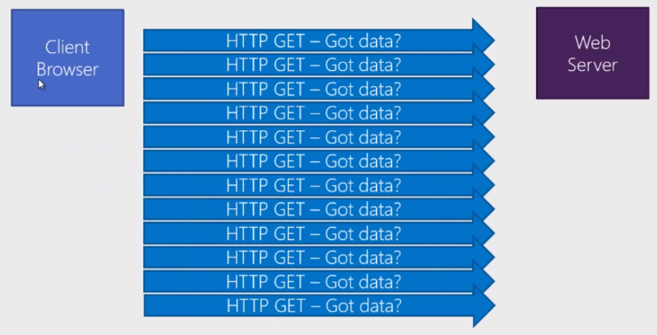
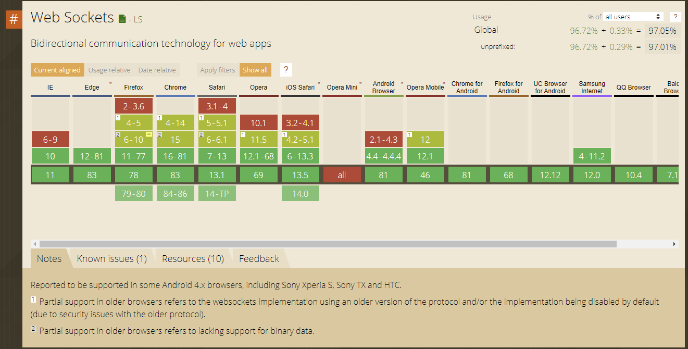

# SignalR

## Worum geht es bei SignalR

- Realtime Kommunikation zwischen Clients und Servern
- „Scale Out“: Möglichkeit über mehrere Server hinweg Nachrichten zu verschicken
- Unterstützung von JS, .NET, Java und weiteren Client-Architekturen
- Ursprünglich erfunden von [David Fowler](https://github.com/davidfowl) und [Damian Edwards](https://github.com/DamianEdwards)

## Wie kann uns SignalR bei der Echzeitkommunikation unterstützen?

Ursprünglich war eine Zwei-Wege-Kommunikation in HTTP nicht vorgesehen. Die häufigste Lösung dennoch über Änderungen auf Serverseite informiert zu werden, ohne die Seite neu zu laden, ist `Polling`. Dabei wird in regelmäßigen Intervallen der Server angefragt, ob es Neuigkeiten für den Client gibt.

Dieses Vorgehen ist sehr ineffizient. Über die Jahre gab es mehrere Erweiterungen wie Server Sent Events, um eine persistente Kommunikation zwischen Client und Server herzustellen. Die neueste Technologie sind Web-Sockets. Damit wird es Client und Server ermöglicht, ein bidirektionalen Kommunikationskanal herzustellen.

Um die Verwendung von Web-Sockets für den Anwender transparent zu machen, wurde SignalR eingeführt.

SignalR bietet dem Entwickler eine API, um eine RPC-ähnliche Echtzeitkommunikation umzusetzen, ohne das sich dieser mit den unterstützten Technologien auseinandersetzen oder unterschiedliche Implementierungen bereitstellen zu müssen.

SignalR ist fester Bestandteil von `aspnetcore` und integriert sich nahtlos ins Endpoint-Routing System.

## Unterstützung von Web-Sockets

Web Sockets werden von allen modernen Browsern unterstützt.

## Web-Socket Fallbacks

Die Probleme beginnen jedoch, wenn Client oder Server keine Web-Sockets unterstützen, oder diese durch Firewalls geblockt werden.

- Websockets müssen vom Betriebssystem / Webserver / Firewall zugelassen und unterstützt werden
- Windows: Mind. Server 2008 R2 oder Windows 8 und .NET Framework 4.5

| Technologie        |                                                                                                                                                                                                          |
| ------------------ | -------------------------------------------------------------------------------------------------------------------------------------------------------------------------------------------------------- |
| Web-Socket         | Echte, bi-direktionale Verbindung zwischen Server und Client.                                                                                                                                            |
| Server Sent Events | In allen Browsern außer IE verfügbar.                                                                                                                                                                    |
| Forever Frame      | Ein verstecktes IFrame auf der Website das nie mit dem Laden fertig wird. Über das IFrame werden kontinuierlich script-Tags empfangen und ausgewertet. Nicht in der ASP.NET Core Variante verfügbar.     |
| Ajax Long Polling  | Fragt den Server in einem bestimmten Intervall ab, die Verbindung wird solange wie möglich aufrecht erhalten. Bei einem Timeout wird eine neue Verbindung aufgebaut. Nicht in der ASP.NET Core Variante. |

Für SignalR auf aspnetcore wurde der komplette Stack neu geschrieben und die Performance deutlich erhöht. Mehrere 10 tausend Verbindungen stellen für einen Server kein Problem dar.
SignalR wird auch in der neuesten Web-UI Technologie `Blazor` (server-side) eingesetzt, um UI Aktualisierungen ohne Postbacks zu realisieren.

## SignalR Hub

- High-Level Api über die Client(s) und Server miteinander kommunizieren können
- Als Protokolle werden ein JSON-Format und ein binäres MessagePack-Format unterstützt
- Client kann Methoden am Server aufrufen
- Server kann Methoden am Client aufrufen (Oha!)
- RPC-Style
- Als Clients werden aktuell .NET, JS, Java und ab 3.0 C++ unterstützt

## SignalR Clients

- C#: NuGet: Microsoft.AspNetCore.SignalR.Client
- TypeScript: npm: @aspnet/signalr

## Konfigurieren von SignalR

